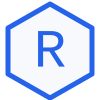
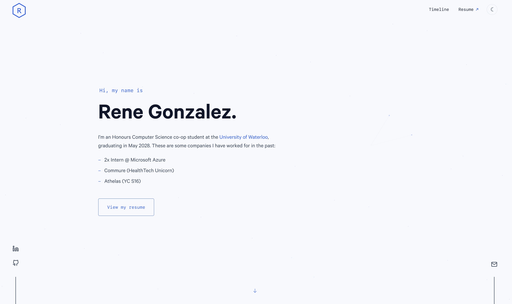

<div align="center">
   
   <h1>Rene Gonzalez</h1>
   <p>Personal portfolio built with Gatsby and React.</p>
   <p><a href="https://reneleo.com">reneleo.com</a></p>
</div>

<a href="https://reneleo.com">
   
</a>

## Stack

- Gatsby 3
- React 17
- styled-components
- Netlify

## Development

Use the Node version in `.nvmrc` and install dependencies with Yarn.

```sh
nvm install
nvm use
yarn install --frozen-lockfile
yarn develop
```

The development site runs at `http://localhost:8000`.

## Production

Build and preview the static site locally:

```sh
yarn build
yarn serve
```
